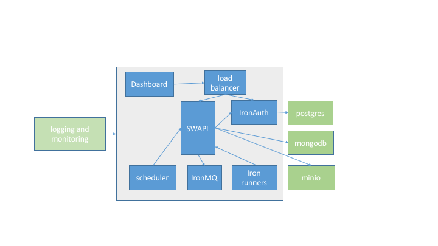

## Architecture Diagram

This is how the pieces fit together:

* [QuickStart Installation](/worker/on-premise/quickstart)
* [Load Testing](/worker/on-premise/load-testing)
* [Scaling](/worker/on-premise/scaling)
* [Manual Installation](/worker/on-premise/manual)
* [Docker Registry Setup](/worker/on-premise/docker-registry)
